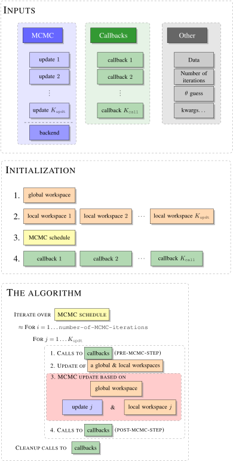

# [Understanding the internal components of the sampler](@id manual_start)
It is important to understand the main principles behind the underlying algorithm, as they shed light on understanding the individual components. Once you understand the big picture it should also be easier to write your own extensions.

The structure of the algorithm can be summarized with the following graph which we will break down below:

## Inputs

The inputs to the algorithm are of three types.

### MCMC

The MCMC object is simply a list of `update`s and a specification of a `backend`. At each MCMC iteration the sampler will cycle through the list of these `update`s and perform each of them consecutively, as depicted in the red box in `The Algorithm` (subject to some modifications, TODO see advanced use). This list is *de facto* how you point to a specific MCMC algorithm and ask the sampler to use it. The last, optional argument `backend` is a way to use your own `Workspace`s. If default `backend` is used, then also default `Workspace`s will be created at the `Initialization` step.

### Callbacks

Callbacks are instructions that allow for certain interactions with the state of the sampler while it is still working. In `The Algorithm` section of a graph you can see that each callback may be executed before and after any call to an MCMC update. These can be such instructions as:
- print useful info to the console about the state of the sampler
- update diagnostic plots
- save the data to a csv file

### Other

These are some prerequisites for running an MCMC sampler, such as:
- the data
- specification of the number of MCMC iterations
- initial guess of a parameter
As well as some additional named options (`kwargs...`) that will be passed down to various initializers and that may be used by your own Workspaces etc.

## Initialization
At the time of initialization of the sampler the global, **and then**, local workspaces are created. The concept of workspaces is central to ExtensibleMCMC and it is the reason why the package can be efficient even for very computationally intensive problems. The workspaces are essentially pre-allocated pieces of memory needed by the MCMC sampler. Consequently, if implemented correctly, the bottleneck of the algorithm should lie in computations and not memory-allocations.

!!! tip
    Often times local workspaces are best conceptualized as a window view of some substate of the global workspace. The global workspace is initialized before local workspaces and is passed to the initializers of local workspaces. Consequently, it is often reasonable to define certain fields of the local workspaces as `view`s to the relevant fields of the global workspace.

After workspaces, the `MCMCSchedule` is initialized. It is an iterator that iterates through the MCMC steps and at each step iterates through `update`s to perform. In the simplest setting it takes a form of a simple double for loop as illustrated in `The Algorithm`, but it can be modified.

Finally, each of the callback is given a chance to perform some initializations.

## The algorithm
In principle, there is nothing explicit about `The Algorithm` being a representation of an `MCMC` algorithm. It becomes one implicitly, by the virtue of `update`s being of the MCMC type.

The important part is marked in red. It represents a single MCMC update and illustrates that each update sees the corresponding pair of `update` and its local `workspace` as well global `workspace` and performs updates based on instructions in `update` and using pieces of memory that are in a local and the global `workspace`.

Additionally, notice that prior to each call to mcmc update there is an update call that allows for some exchange of information between the local and global workspaces.

See further sections of this manual to learn more about various components of the algorithm's flow above.
