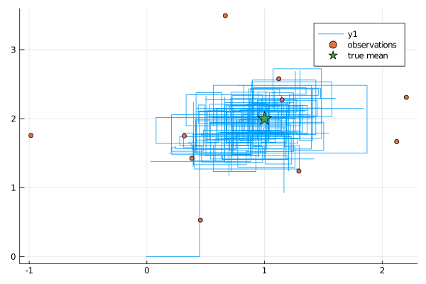
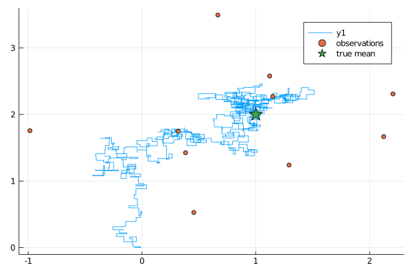
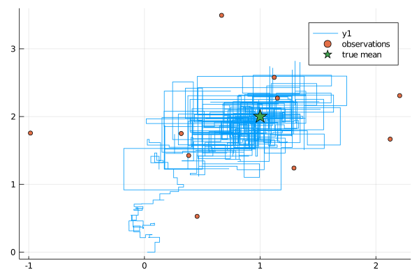
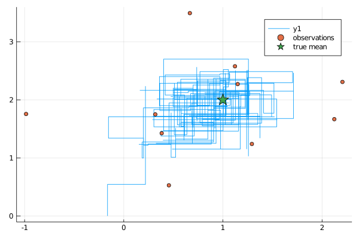
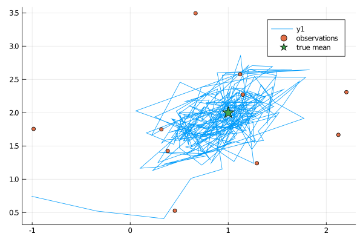
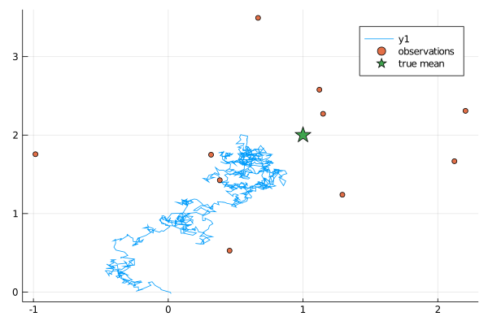
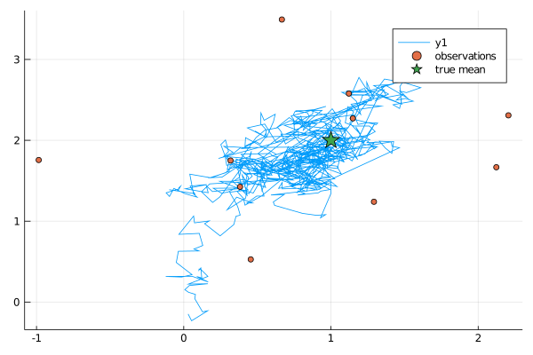

# [Estimating mean of a bivariate Gaussian](@id tutorial_mean_of_bivariate_gsn)

> For this tutorial we will show to estimate a mean of a bivariate Gaussian random variable from its 10 observations using a package ExtensibleMCMC.jl. We will define a `target law` and two methods: `set_parameters!` and `loglikelihood` that dispatch on our `target law`. We will then generate some data, show how to parameterize the Markov chain and run the sampler. Finally, we will show how to inspect the results.

## Defining the target law
In [this folder](https://github.com/JuliaDiffusionBayes/ExtensibleMCMC.jl/tree/master/src/example) we have already defined some examples of the targets laws and a Gaussian law (with a possibility to estimate its mean and covariance matrix) is one of them. For the pedagogical purposes we define the new `BivariateGaussian` struct below.

We start from defining the target law.
```julia
using Distributions
using ExtensibleMCMC
const eMCMC = ExtensibleMCMC

mutable struct BivariateGaussian{T}
    P::T
    function BivariateGaussian(μ, Σ)
        @assert length(μ) == 2 && size(Σ) == (2,2)
        P = MvNormal(μ, Σ)
        new{typeof(P)}(P)
    end
end
```
We chose to define it as a mutable struct and use a pre-defined `MvNormal` struct from `Distributions` package to encode the probability law. In this way, when parameters change, we may define a new `MvNormal` struct, with new parameters and then write over the field `P` of `BivariateGaussian`, changing it to a new struct with new parameters. !!! tip
    Depending on the application, you might want to consider changing this convention, define the `target law` using an immutable struct and have the representation of the probability law be represented by a mutable struct so that its parameters can be changed or, alternatively, have the parameters themselves be represented internally by a mutable vector.

ExtensibleMCMC.jl expects to have two functions implemented for the `target law`. The first one is a setter of new parameters
```julia
function eMCMC.set_parameters!(gsn::BivariateGaussian, loc2glob_idx, θ)
    μ, Σ = params(gsn.P)
    μ[loc2glob_idx] .= θ
    gsn.P = MvNormal(μ, Σ)
end
```
Here, `loc2glob_idx` is a vector of indices pointing to parameters that are to be updated. For instance, if the MCMC step concerns only entries `3` and `6` of the `10` dimensional parameter vector `θ`, then `loc2glob_idx=[3,6]`. The second expected method is evaluation of the log-likelihood that extends the method defined in `Distributions` for the `target law`:
```julia
function Distributions.loglikelihood(gsn::BivariateGaussian, observs)
    ll = 0.0
    for obs in observs
        ll += logpdf(gsn.P, obs)
    end
    ll
end
```
Here, `logpdf` is defined in `Distributions` and works by the virtue of `typeof(gsn.P) <: MvNormal`.

We're good to go!

## Generating the data
We may simulate some test data. The important point is that unless you overload the `update` functions yourself, the data should be stored in the format of a `NamedTuple` with fields `P` containing the `target law` and `obs` with a vector of observations.
```julia
using Random
Random.seed!(10)
μ, Σ = [1.0, 2.0], [1.0 0.5; 0.5 1.0]
trgt = MvNormal(μ, Σ)
num_obs = 10

data = (
    P = BivariateGaussian(rand(2), Σ),
    obs = [rand(trgt) for _ in 1:num_obs],
)
```
In here we set the mean of `P` to random vales. The actual values don't matter and will be overwritten by the `θinit`—the initial guess for the mean.

## Parametrizing the MCMC sampler
We will start with a simple Metropolis-within-Gibbs algorithm that does single-site updates (alternately updating the two coordinates of the mean) and we will run it for $$10^3## iterations. We will also use improper flat priors.

!!! note
    one update of coordinate `1` + one update of coordinate `2` == a single MCMC iteration

This can be simply encoded as follows:
```julia
mcmc_params = (
    mcmc = MCMC(
        [
            RandomWalkUpdate(UniformRandomWalk([1.0]), [1]; prior=ImproperPrior()),
            RandomWalkUpdate(UniformRandomWalk([1.0]), [2]; prior=ImproperPrior()),
        ]
    ),
    num_mcmc_steps = Integer(1e3),
    data = data,
    θinit = [0.0, 0.0],
)
```
## Running the sampler
With parameterization of the sampler in place, running it is a one-liner
```julia
workspace, local_workspaces = run!(mcmc_params...)
```

## Inspecting the results
The output of the sampler is a global `Workspace` and all local `Workspace`s. The global
workspace holds the entire history of the chain. We can plot it, together with the observations and the true mean to see if we've done OK.
```julia
using Plots
function plot_results(ws)
    θhist = collect(Iterators.flatten(ws.sub_ws.state_history))
    p = plot(map(x->x[1], θhist), map(x->x[2], θhist))
    scatter!(map(x->x[1], data.obs), map(x->x[2], data.obs), label="observations")
    scatter!(map(x->[x], μ)..., label="true mean", marker=:star, ms=10)
    display(p)
end
plot_results(workspace)
```



It turns out we did!

## [Mis-specification of hyper-parameters and adaptation](@id mean_of_bivariate_gsn_adpt)
One of the reasons why we did relatively well in recovering the posterior over the mean parameter was because our proposals were quite decent. However, finding good proposals is a delicate issue. For the uniform random walker this translates to finding a good value for the half-range of steps `ϵ`. What happens if we set it to too small?
```julia
mcmc_params = (
    mcmc = MCMC(
        [
            RandomWalkUpdate(UniformRandomWalk([0.1]), [1]; prior=ImproperPrior()),
            RandomWalkUpdate(UniformRandomWalk([0.1]), [2]; prior=ImproperPrior()),
        ]
    ),
    num_mcmc_steps = Integer(1e3),
    data = data,
    θinit = [0.0, 0.0],
)

workspace, local_wss = run!(mcmc_params...)
plot_results(workspace)
```



Well, we can see that we are much much slower in exploring the posterior. Finding ϵ by hand might be problematic and to this end there are standard adaptation techniques that target fixed acceptance rate of the sampler by adjusting the ϵ parameter. We can turn such adaptive schemes on using ExtensibleMCMC and then no matter that we start from a mis-specified ϵ, after some burn-in we should find much better candidates for it.
```julia
mcmc_params = (
    mcmc = MCMC(
        [
            RandomWalkUpdate(
                UniformRandomWalk([0.1]), [1];
                prior=ImproperPrior(),
                adpt=AdaptationUnifRW(
                    [0.0];
                    adapt_every_k_steps=50,
                    scale=0.1,
                ),
            ),
            RandomWalkUpdate(
                UniformRandomWalk([0.1]), [2];
                prior=ImproperPrior(),
                adpt=AdaptationUnifRW(
                    [0.0];
                    adapt_every_k_steps=50,
                    scale=0.1,
                ),
            ),
        ]
    ),
    num_mcmc_steps = Integer(1e3),
    data = data,
    θinit = [0.0, 0.0],
)

workspace, local_wss = run!(mcmc_params...)
plot_results(workspace)
```



# Gaussian random walk proposals with single-site updates
Sampling from the uniforms may be easily substituted with sampling from Gaussians as the following example demonstrates

```julia
mcmc_params = (
    mcmc = MCMC(
        [
            RandomWalkUpdate(
                GaussianRandomWalk([1.0]), [1];
                prior=ImproperPrior(),
            ),
            RandomWalkUpdate(
                GaussianRandomWalk([1.0]), [2];
                prior=ImproperPrior(),
            ),
        ]
    ),
    num_mcmc_steps = Integer(1e3),
    data = data,
    θinit = [0.0, 0.0],
)

workspace, local_wss = run!(mcmc_params...)
plot_results(workspace)
```



# Bivariate random walk proposals
Naturally, it might be desirable to substitute single-site updates with joint updates. This is again very easily implementable:

```julia
using LinearAlgebra
mcmc_params = (
    mcmc = MCMC(
        [
            RandomWalkUpdate(
                GaussianRandomWalk(0.5*Diagonal{Float64}(I, 2)), [1,2];
                prior=ImproperPrior(),
            ),
        ]
    ),
    num_mcmc_steps = Integer(1e3),
    data = data,
    θinit = [0.0, 0.0],
)

workspace, local_wss = run!(mcmc_params...)
plot_results(workspace)
```



Of course, the higher the dimension of proposals the more difficult it becomes to find a suitable covariance matrix for the proposals. For instance, this is what happens if the covariance is not scaled suitably:

```julia
using LinearAlgebra
mcmc_params = (
    mcmc = MCMC(
        [
            RandomWalkUpdate(
                GaussianRandomWalk(0.001*Diagonal{Float64}(I, 2)), [1,2];
                prior=ImproperPrior(),
            ),
        ]
    ),
    num_mcmc_steps = Integer(1e3),
    data = data,
    θinit = [0.0, 0.0],
)

workspace, local_wss = run!(mcmc_params...)
plot_results(workspace)
```



# Haario-type adaptation for multivariate Gaussian random walk proposals
We may however employ Haario-type adaptive schemes very easily to learn the covariance in an adaptive way.

```julia
mcmc_params = (
    mcmc = MCMC(
        [
            RandomWalkUpdate(
                GaussianRandomWalkMix(
                    0.01*Diagonal{Float64}(I, 2),
                    0.01*Diagonal{Float64}(I, 2)
                ),
                [1,2];
                prior=ImproperPrior(),
                adpt=HaarioTypeAdaptation(
                    rand(2);
                    adapt_every_k_steps=50,
                    f=((x,y,z)->(0.01+1/y^(1/3))),
                ),
            ),
        ]
    ),
    num_mcmc_steps = Integer(1e3),
    data = data,
    θinit = [0.0, 0.0],
)

workspace, local_wss = run!(mcmc_params...)
plot_results(workspace)
```


